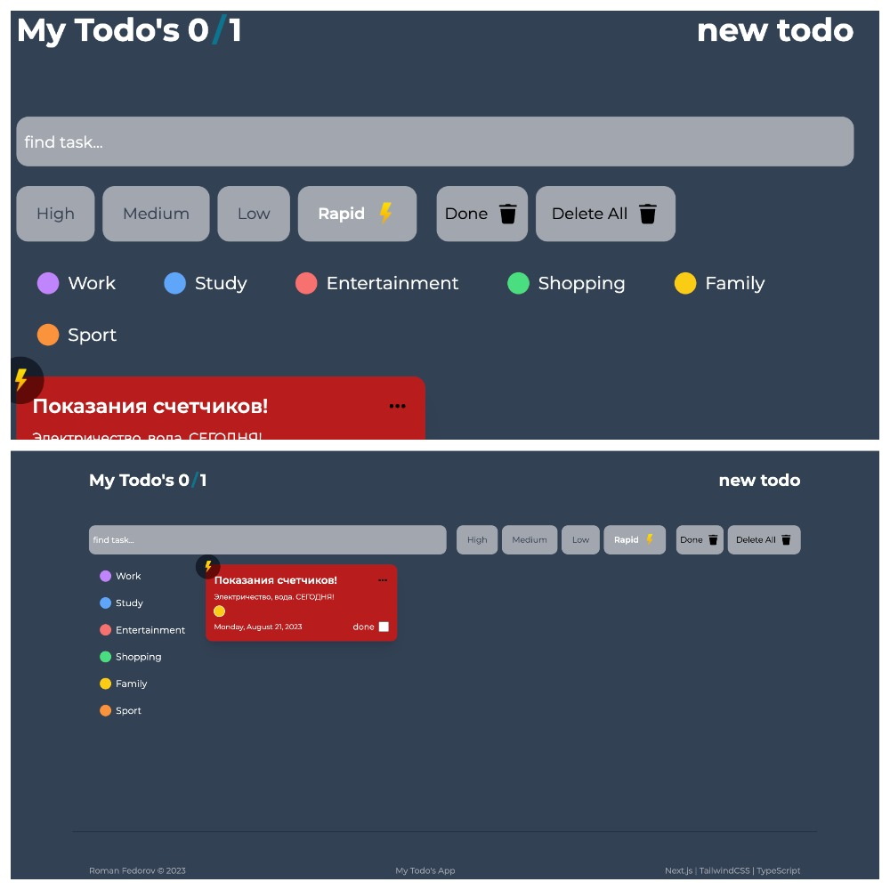

# Todo's


 



## Запуск проекта 
1) Установить зависимости

```bash
npm install
```
2) Запустить проект в режиме разработки на [http://localhost:3000](http://localhost:3000)
```bash
npm run dev
# or
yarn dev
```
## О проекте 
- Адаптивный дизайн;
- Реализован CRUD;
- Поиск c debounce, фильтрация задач;
- Вывод сообщения о результатах поиска;
- Возможность присвоить теги и приоритет задачам;
- Управление основных компонентов с помощью кастомных хуков;
- Контекст для всех основных компонентов;
- createPortal для модальных окон;
- Небольшая анимация с помощью Framer Motion;
- Типизация с помощью TypeScript;

